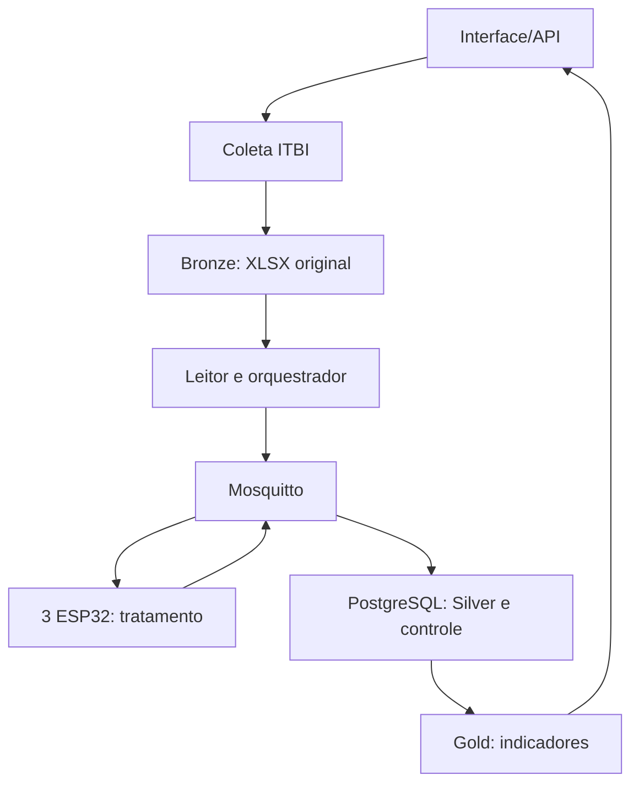

# TCC — Especificação de implementação

**Tema:** Desenvolvimento de um Framework com Arquitetura Distribuída de Baixo Custo para Processamento de Dados  
**Caso de estudo:** guias de ITBI pagas do município de São Paulo  
**Fonte oficial:** https://prefeitura.sp.gov.br/web/fazenda/w/acesso_a_informacao/31501  
**Status:** especificação para implementação incremental; limites de memória e tempo serão medidos nos ESP32 físicos.

## 1. Objetivo e regra central

Construir uma API que coleta e preserva planilhas de ITBI, distribui registros para três nós físicos ESP32 e reúne os dados tratados. **As regras de limpeza dos valores dos registros executam nos ESP32**, em MicroPython. O computador pode ler XLSX, reconhecer cabeçalhos, criar lotes, transmitir mensagens, persistir resultados e calcular indicadores agregados; não deve pré-limpar os campos que serão tratados nos dispositivos.

O experimento deve demonstrar que os nós físicos realizaram o processamento e medir correção, tempo, memória e comportamento com 1, 2 e 3 nós. Não usar Kafka nem serviços pagos como requisito de execução.

## 2. Decisões já tomadas

| Item | Decisão |
| --- | --- |
| Entrada | Arquivos anuais de ITBI de São Paulo (a página mostrada lista 2006–2026); começar pela aba `JAN-2026` do arquivo de 27/08/2026 |
| Bronze | Preservar XLSX original em disco; registrar caminho, hash e metadados no PostgreSQL |
| Transporte | MQTT por Wi-Fi; broker Mosquitto no computador |
| Nós | Três ESP32 com MicroPython, cada um com OLED 0,96″ I²C SSD1306 |
| Distribuição | Lotes de 10 registros; um lote ativo por nó; um registro completo por mensagem |
| Processamento | Regras derivadas de `clean_sp()` em `ExtractionRawSP.py`, executadas nos ESP32 |
| Silver e controle | PostgreSQL recebe as respostas e registra execuções, lotes e erros |
| API | FastAPI em Python; inicia a execução e expõe andamento e resultados |
| Gold | Indicadores agregados a partir de Silver; sua definição fina vem após o primeiro ciclo completo |

## 3. Fluxo de ponta a ponta



1. A API recebe um arquivo XLSX ou aciona o coletor adaptado de `SearchDataSetSP.py`.
2. O arquivo é salvo sem alteração em `data/bronze/`; nunca apagá-lo após uma carga bem-sucedida.
3. O leitor percorre apenas abas mensais, detecta cabeçalhos, associa as colunas a nomes canônicos e ignora colunas totalmente vazias. Essa é uma operação de leitura/estrutura, não a limpeza dos valores.
4. O orquestrador atribui a cada linha um identificador estável de origem: arquivo + aba + número real da linha. Monta lotes de até 10 linhas e escolhe um ESP32 livre por lote.
5. O orquestrador envia um registro por mensagem ao nó escolhido. O ESP32 aplica as regras, atualiza o OLED e devolve um resultado por registro.
6. A API grava cada resposta de forma idempotente no PostgreSQL, confirma o avanço e envia o próximo registro do lote. Ao receber todos, encerra o lote e libera o nó.
7. Os resultados Silver são derivados exclusivamente das respostas dos ESP32. Gold é calculado a partir do Silver.

### Coleta por ano e execução seletiva

A página oficial consultada em 29/09/2026 lista links Excel/xlsx e ODS anuais de **2006 a 2026**. A API deve descobrir os anos disponíveis pelos rótulos e links da página, selecionando especificamente o link Excel/xlsx do ano solicitado (não inferir o ano apenas pela URL). Deve permitir coletar **um ano específico** ou todos os anos, sem iniciar automaticamente o processamento. Arquivos já preservados em Bronze não precisam ser baixados novamente quando o conteúdo não mudou; manter versões diferentes do mesmo ano se o conteúdo mudou (por exemplo, atualização do ano corrente). Armazenar URL de origem e data de coleta no catálogo. Algumas URLs antigas redirecionam para outro domínio; tratar redirecionamentos de forma explícita.

Uma execução escolhe **um arquivo/versionamento e um ano**, com mês opcional. Para testes, aceita `limite_registros`, sem alterar o XLSX em Bronze. Filtrar pelas abas mensais `JAN-AAAA` a `DEZ-AAAA` cujo ano corresponde ao solicitado; o ano no nome do arquivo é uma pista, não substitui a validação da aba. A `data_transacao` real não é filtrada pelo ano da aba: a Prefeitura explica que o mês da tabela corresponde à **DTI paga naquele mês**, independentemente da data da transação. Expor quais meses estão disponíveis, pois o arquivo de 2026 analisado contém somente janeiro a julho. A Prefeitura informa que o arquivo do ano corrente recebe atualizações mensais com os dados do mês anterior.

**Exemplo:** coletar o arquivo de 2019 e o de 2026; iniciar uma execução de `ano=2026`, `mes=JAN`, `limite_registros=10`. O sistema processa apenas as primeiras dez linhas de dados válidas dessa aba. Os arquivos dos outros anos permanecem disponíveis para execuções posteriores. Uma execução completa de todos os anos deve ser uma ação explícita e acompanhável, com progresso por arquivo e por ano.

## 4. Fontes reais e diferenças de layout

Arquivos analisados: `GUIAS_DE_ITBI_PAGAS_(2019) (1).xlsx`, `GUIAS DE ITBI PAGAS (28012026) XLS.xlsx` e `GUIAS DE ITBI PAGAS (27082026) XLS.xlsx`.

- As abas mensais têm 28 campos úteis. Algumas abas têm uma 29ª coluna sem cabeçalho.
- Em 2019, as duas últimas colunas aparecem com o mesmo título `ACC (IPTU)`; a primeira representa a descrição do padrão e a última representa `acc_iptu`. O mapeamento deve considerar sua posição e ser conferido com a amostra.
- Em `FEV-2026`, aparece `Descrição do pardão (IPTU)`, grafia não coberta pelo mapeamento original. Mapear também para `descricao_padrao`.
- Datas já podem vir como células do tipo data, números monetários como números do Excel e CEPs como inteiros sem zero inicial. A serialização para JSON não deve alterar o significado do dado: datas de origem são representadas como texto ISO; números usam sua representação textual; identificadores e CEP não devem passar por `float`.
- O ano da aba indica a organização da planilha, mas uma `data_transacao` pode pertencer ao ano anterior. Não corrigir a data com base no nome da aba.
- A página oficial informa correções nos arquivos de 2019, 2020 e 2021 relativas à descrição das naturezas de transação. Preservar a versão e o hash do arquivo coletado e permitir atualizar a fonte sem sobrescrever o Bronze anterior.
- Abas `LEGENDA`, `EXPLICAÇÕES`, `Tabela de USOS` e `Tabela de PADRÕES` não são registros de transação.

Preservar todas as colunas úteis no registro transmitido e devolvido. O ESP32 transforma apenas os campos com regra aplicável e mantém os demais. Colunas desconhecidas e conflitos de cabeçalho devem ser registrados como erro de leitura, sem descarte silencioso.

## 5. Fronteira do processamento

| Computador/API | ESP32 |
| --- | --- |
| Baixar e abrir XLSX; identificar aba, cabeçalho e número da linha | Remover espaços e tratar valores textuais vazios |
| Salvar Bronze; criar IDs e lotes; escolher nó | Normalizar `numero` e `cep`; validar CEP sem inventar dígitos |
| Converter tipos de célula apenas para representação transportável em JSON | Converter campos numéricos de `COLS_DOUBLE`, inclusive valores monetários e áreas |
| Persistir resposta do nó; detectar registros repetidos entre lotes | Tratar `data_transacao` e `acc_iptu`; sinalizar conversões inválidas |
| Calcular indicadores Gold com Silver já processado | Mostrar lote, progresso e erros no OLED |

**Regras de referência:** `schema_sp`, `COLS_DOUBLE`, `COLS_STR` e `clean_sp()` do código fornecido. Não portar pandas/Spark para o ESP32: reimplementar as operações de campo em MicroPython, documentando qualquer diferença de comportamento. `uf`, `mes`, `arquivo_origem`, `linha_origem` e `data_insercao` são metadados atribuídos pelo orquestrador/banco, não uma limpeza imobiliária.

**Tratamento de inválidos:** valores ausentes viram `null`; falhas de conversão geram `null` no campo tratado e um erro com nome do campo e motivo. CEP com menos de oito dígitos pode receber zero inicial **somente quando o valor veio numericamente do Excel**, situação em que o zero se perdeu na representação; um CEP textual incompleto deve ser sinalizado. CEP com mais de oito dígitos ou caracteres inesperados não deve ser aceito silenciosamente. Registrar valor original para auditoria. A política final de formatos numéricos e datas deve ser fixada em casos de teste antes do firmware definitivo.

Para valores monetários, evitar arredondamento binário no armazenamento: representar o resultado como número decimal canônico em texto no MQTT e convertê-lo a `numeric` no PostgreSQL. Testar explicitamente separadores como `605994.39` e `R$ 605.994,39`.

## 6. Contrato MQTT v1

Tópicos iniciais:

| Tópico | Emissor → receptor | Conteúdo |
| --- | --- | --- |
| `tcc/nos/{no_id}/tarefa` | Orquestrador → nó | Um registro bruto de lote atribuído |
| `tcc/resultados` | Nó → orquestrador | Registro tratado ou erro de processamento |
| `tcc/nos/{no_id}/estado` | Nó → orquestrador | Disponibilidade e lote em andamento |

Mensagem de tarefa, abreviada para leitura; na implementação `dados` contém as 28 colunas canônicas:

```json
{
  "versao": 1,
  "execucao_id": "exec-001",
  "lote_id": "lote-014",
  "registro_id": "arquivo-01:JAN-2026:2",
  "no_id": "esp32-02",
  "posicao": 1,
  "total_lote": 10,
  "dados": {
    "id": "12318300101",
    "cep": 5662000,
    "bairro": "JD MORUMBI",
    "valor_transacao": "428832",
    "data_transacao": "2025-08-29"
  }
}
```

Resposta, também abreviada:

```json
{
  "versao": 1,
  "execucao_id": "exec-001",
  "lote_id": "lote-014",
  "registro_id": "arquivo-01:JAN-2026:2",
  "no_id": "esp32-02",
  "posicao": 1,
  "status": "processado",
  "dados_tratados": {
    "id": "12318300101",
    "cep": "05662000",
    "bairro": "JD MORUMBI",
    "valor_transacao": "428832",
    "data_transacao": "2025-08-29"
  },
  "erros": []
}
```

O exemplo de CEP representa o zero inicial recuperado **por ter sido uma célula numérica**. A implementação deve transportar essa informação de tipo ou um marcador de origem no envelope, para que o nó possa distinguir esse caso de texto incompleto. Os demais campos omitidos nos exemplos devem estar presentes nas mensagens reais.

Usar QoS 1 para tarefas e respostas, IDs estáveis e inserção idempotente no banco: QoS 1 permite entregas repetidas. Não usar mensagens de tarefa retidas. O orquestrador envia o próximo registro do lote após persistir a resposta do anterior, mantendo baixa a ocupação de RAM. O nó informa seu estado e usa o OLED como visualização local. Não depender apenas de uma mensagem `lote concluído`: a fonte de verdade é a contagem persistida de respostas únicas.

## 7. Distribuição e recuperação

- Três nós têm IDs fixos `esp32-01`, `esp32-02`, `esp32-03` e assinam apenas seu tópico de tarefa.
- O orquestrador atribui o próximo lote pendente ao primeiro nó disponível. Cada lote pertence a apenas um nó de cada vez. Um lote final pode ter menos de 10 registros.
- Estados de lote: `pendente`, `atribuido`, `processando`, `concluido`, `falhou`. Registrar horários, nó e número de tentativas.
- Se não houver resposta no prazo configurável, marcar a tentativa como expirada. Reenviar o registro pendente ou reatribuir o lote a outro nó; respostas atrasadas precisam ser reconhecidas como duplicadas e nunca sobrescrever um resultado já aceito.
- Em caso de reinício da API, restaurar lotes e respostas a partir do PostgreSQL. Uma execução só é `concluida` quando todos os registros esperados têm resultado persistido.
- Medir tempo de fila, trânsito MQTT, tempo relatado pelo nó, tempo total, tentativas, quantidade de erros e memória livre observada no nó.

## 8. PostgreSQL: modelo lógico mínimo

| Tabela | Conteúdo e chaves importantes |
| --- | --- |
| `arquivos_bronze` | ID, nome original, caminho, SHA-256, tamanho, data de coleta; hash evita importação acidental do mesmo arquivo |
| `execucoes` | ID, arquivo, abas selecionadas, status, total esperado, iniciado/concluído em |
| `lotes` | ID, execução, número, nó atribuído, estado, total (até 10), tentativas, timestamps |
| `registros_origem` | Execução, arquivo, aba, linha, lote, JSON bruto serializado; chave única por execução + arquivo + aba + linha para auditoria e reenvio |
| `registros_silver` | Execução, registro de origem, nó, dados tratados, erros, duração, recebido em; chave única por execução + registro de origem |
| `eventos_execucao` | Mudanças de estado, desconexões, timeouts, reenvios e erros operacionais |

Os resultados podem começar em `jsonb`, mantendo dados originais e tratados lado a lado por identificador. Definir projeções tipadas para consultas e Gold após validar o esquema real. `Gold` pode ser uma consulta, visão ou tabela derivada; nunca contar duas vezes uma resposta MQTT repetida. Guardar credenciais em variáveis de ambiente, sem colocá-las no repositório.

## 9. API v1 e interface

| Rota proposta | Função |
| --- | --- |
| `POST /arquivos` | Registrar XLSX enviado e salvar Bronze |
| `GET /fontes/itbi-sp/anos` | Listar anos descobertos e quais arquivos já estão em Bronze |
| `POST /coletas/itbi-sp` | Coletar `ano` específico ou `todos=true`; baixar sem iniciar processamento |
| `POST /execucoes` | Escolher `arquivo_id`, `ano`, `mes` opcional e `limite_registros` opcional; iniciar distribuição |
| `GET /execucoes/{id}` | Estado, totais, lotes, progresso e erros |
| `GET /execucoes/{id}/registros` | Resultados Silver paginados |
| `GET /nos` | Conectividade e lote atual dos ESP32 |
| `GET /execucoes/{id}/indicadores` | Indicadores Gold após haver Silver |

A interface web aciona as rotas e acompanha o progresso. Ela deve permitir escolher o ano disponível, o mês e o limite de linhas para testes. Ela não precisa estar pronta para o primeiro teste de ponta a ponta: a documentação interativa da FastAPI já permite iniciar a execução. Um comando HTTP não deve bloquear até uma planilha inteira terminar; retornar o ID e acompanhar o estado separadamente.

## 10. Firmware e OLED

Firmware MicroPython dividido em conexão Wi-Fi, cliente MQTT, regras de tratamento, tela OLED e telemetria. Configurar broker, credenciais e ID do nó fora do código versionado. O firmware nunca acessa diretamente o PostgreSQL ou lê XLSX.

Exibição sugerida no SSD1306:

```text
NO 02  MQTT OK
LOTE 014
REG  04/10
ERROS 01
```

Estados úteis: conectando, disponível, recebendo, processando, publicando, erro e reconectando. Atualizar `REG` após concluir cada registro. Se houver reinício, o banco do orquestrador determina o que falta; a tela reflete o trabalho atual do nó.

## 11. Plano de implementação para vibe coding

1. **Contrato e fixtures:** extrair dez linhas reais de `JAN-2026` como exemplos de leitura, registrar valores brutos e saídas esperadas das regras; cobrir também 2019, 2025 e a grafia de FEV-2026. Não versionar planilhas gigantes no projeto sem necessidade.
2. **Bronze e API:** adaptar descoberta e coleta por ano, upload, leitura de abas/cabeçalhos e cadastro de arquivos. Permitir escolher ano/mês/limite de registros por execução. Confirmar que nenhum campo de dado é pré-limpo.
3. **Banco e orquestrador:** criar migrações PostgreSQL, lotes, estado, distribuição, MQTT, timeout e idempotência.
4. **Firmware:** portar regras, MQTT e OLED. Primeiro provar uma mensagem/registro, depois um lote de 10 e depois três nós.
5. **Silver e Gold:** gravar respostas completas, conferir contagens, disponibilizar consulta e implementar indicadores escolhidos.
6. **Avaliação:** repetir um conjunto fixo com 1, 2 e 3 nós, reportando configuração, tempos, erros, memória e comportamento com um nó desconectado.

### Critérios de aceite da primeira demonstração

- Um XLSX de exemplo está preservado em Bronze e registrado no PostgreSQL.
- Dez registros com 28 campos são enviados individualmente ao mesmo ESP32 como um lote identificado.
- Os dez registros recebem tratamento no ESP32; o OLED mostra o lote e avança até `10/10`.
- Silver contém dez respostas únicas ligadas às linhas originais e ao nó físico; valores tratados e erros podem ser auditados.
- Uma repetição da resposta MQTT não duplica registros; uma desconexão deixa o trabalho pendente e recuperável.
- A API informa `concluida` apenas depois das dez respostas únicas persistidas.

## 12. Instruções para a IA implementadora

Trate este documento como especificação principal. Examine o repositório antes de criar arquivos, aproveite o que já existe e implemente em etapas pequenas verificáveis. Use `SearchDataSetSP.py` e `ExtractionRawSP.py` como **referências de lógica**, removendo dependências de Databricks/Spark do projeto novo. Preserve os XLSX originais. Não simule o processamento como solução final nem aplique no backend as regras que pertencem aos ESP32. Evite inventar dados, credenciais ou resultados medidos; quando o hardware estiver indisponível, entregue API e firmware compiláveis/testáveis separadamente e declare que o teste físico continua pendente. Ao final de cada etapa, relate arquivos alterados, execução verificada e bloqueios reais.
