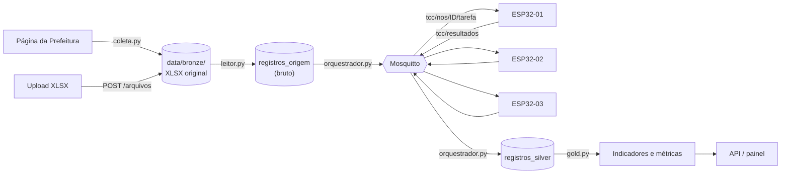
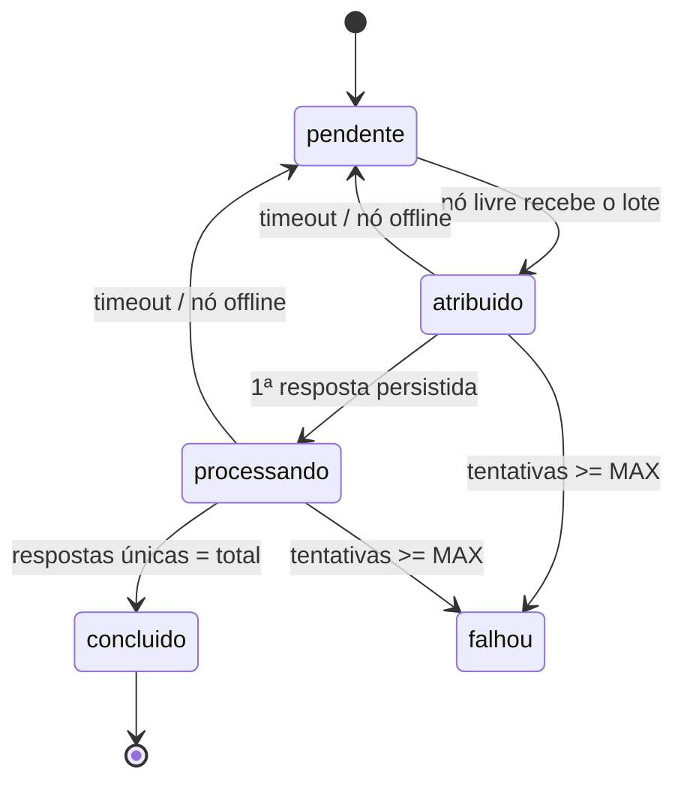

# Explicação da implementação — v1

**Projeto:** Framework com Arquitetura Distribuída de Baixo Custo para Processamento de Dados
**Caso de estudo:** guias de ITBI pagas do município de São Paulo
**Especificação de origem:** `documento/v1/document.md`
**Data:** 29/09/2026

Este documento explica **tudo o que foi implementado**: a arquitetura, cada arquivo, as decisões
tomadas (e por quê), como os dados fluem do XLSX até os indicadores, como o sistema reage a falhas,
como foi testado e o que ainda falta. Serve como referência para o texto do TCC e para quem for
continuar o código.

---

## Sumário

1. [Visão geral](#1-visão-geral)
2. [Estrutura de pastas](#2-estrutura-de-pastas)
3. [Infraestrutura e configuração](#3-infraestrutura-e-configuração)
4. [Fluxo de ponta a ponta com um exemplo real](#4-fluxo-de-ponta-a-ponta-com-um-exemplo-real)
5. [Camada Bronze e coleta](#5-camada-bronze-e-coleta)
6. [Leitor de planilhas](#6-leitor-de-planilhas)
7. [Regras de tratamento (executadas no ESP32)](#7-regras-de-tratamento-executadas-no-esp32)
8. [Contrato MQTT v1](#8-contrato-mqtt-v1)
9. [Orquestrador: distribuição, falhas e recuperação](#9-orquestrador-distribuição-falhas-e-recuperação)
10. [Banco de dados PostgreSQL](#10-banco-de-dados-postgresql)
11. [API REST e painel web](#11-api-rest-e-painel-web)
12. [Firmware do ESP32](#12-firmware-do-esp32)
13. [Gold e métricas do experimento](#13-gold-e-métricas-do-experimento)
14. [Simulador de nó](#14-simulador-de-nó)
15. [Testes e verificações realizadas](#15-testes-e-verificações-realizadas)
16. [Diferenças em relação ao código de referência](#16-diferenças-em-relação-ao-código-de-referência)
17. [Como executar](#17-como-executar)
18. [Roteiro do experimento com 1, 2 e 3 nós](#18-roteiro-do-experimento-com-1-2-e-3-nós)
19. [Critérios de aceite: situação](#19-critérios-de-aceite-situação)
20. [Limitações e próximos passos](#20-limitações-e-próximos-passos)

---

## 1. Visão geral

O sistema tem três partes que conversam entre si:

| Parte | Onde roda | Tecnologia | Papel |
| --- | --- | --- | --- |
| API + orquestrador | computador | Python 3.12, FastAPI, paho-mqtt, psycopg | coleta, preserva, lê, distribui, persiste, agrega |
| Broker | computador (Docker) | Mosquitto 2 | transporta mensagens por Wi-Fi |
| Nós de processamento | 3 × ESP32 | MicroPython, umqtt.simple, SSD1306 | **aplicam as regras de limpeza** e mostram o progresso no OLED |
| Banco | computador (Docker) | PostgreSQL 16 | catálogo Bronze, Silver, controle, Gold |

A regra central da especificação foi respeitada: **o computador não limpa os valores dos registros**.
Ele só lê a estrutura (abas, cabeçalhos, linhas) e converte as células para uma forma que caiba em JSON
sem mudar o significado. Espaços extras, CEP sem zero, `R$ 605.994,39`, datas e inteiros são tratados
**dentro do ESP32**. O Silver é formado exclusivamente pelas respostas dos nós.



---

## 2. Estrutura de pastas

```
Projeto_TCC/
├── api/app/
│   ├── config.py            configuração via variáveis de ambiente / .env
│   ├── canonico.py          nomes canônicos das 28 colunas e mapeamento de cabeçalhos
│   ├── leitor.py            leitura XLSX em streaming e serialização das células
│   ├── bronze.py            preservação do arquivo original + catálogo
│   ├── coleta.py            descoberta de anos e download na página oficial
│   ├── execucoes.py         criação de execuções e montagem de lotes
│   ├── orquestrador.py      MQTT, distribuição, timeouts, idempotência, recuperação
│   ├── gold.py              indicadores (Gold) e métricas do experimento
│   ├── db.py                pool de conexões, migrações, registro de eventos
│   ├── main.py              rotas da API
│   ├── migrations/001_inicial.sql   esquema do banco
│   └── static/index.html    painel web
├── firmware/
│   ├── boot.py              inicialização mínima do ESP32
│   ├── main.py              laço principal do nó (Wi-Fi, MQTT, processamento)
│   ├── regras.py            REGRAS DE LIMPEZA (roda no ESP32 e nos testes)
│   ├── tela.py              OLED SSD1306
│   └── config_exemplo.py    modelo de configuração por nó
├── scripts/
│   ├── extrair_fixtures.py  gera amostras de teste a partir das planilhas reais
│   └── simulador_no.py      nó simulado para testes sem hardware
├── tests/
│   ├── fixtures/*.json      amostras reais revisadas
│   ├── test_regras.py       política das regras
│   ├── test_leitor.py       leitura/cabeçalhos/serialização
│   ├── test_integracao.py   orquestrador + Postgres + Mosquitto
│   ├── test_micropython.py  roda as regras no MicroPython real (Docker)
│   └── micropython_regras.py  script executado dentro do MicroPython
├── infra/mosquitto/mosquitto.conf
├── docker-compose.yml
├── requirements.txt / requirements-dev.txt
├── .env / .env.example
└── data/bronze/             arquivos preservados (fora do versionamento)
```

`codigo_inicial/` (os scripts `SearchDataSetSP.py` e `ExtractionRawSP.py`) **não foi alterado**; serviu
apenas como referência de lógica. Nenhuma dependência de Spark/Databricks/pandas entrou no projeto novo.

---

## 3. Infraestrutura e configuração

### Docker Compose

`docker-compose.yml` sobe dois serviços:

| Serviço | Imagem | Porta no computador | Observação |
| --- | --- | --- | --- |
| `tcc-postgres` | postgres:16 | **5434** | volume `tcc_pgdata`; senha vem do `.env` |
| `tcc-mosquitto` | eclipse-mosquitto:2 | **1884** | configuração em `infra/mosquitto/mosquitto.conf` |

As portas padrão (5432/1883) não foram usadas porque a máquina já tinha outro projeto ocupando
1883, 5433 e 8000. A API roda na porta **8010**.

O Mosquitto aceita conexões anônimas — adequado para a rede isolada do laboratório. O arquivo de
configuração explica como ativar `password_file` se for necessário.

### Variáveis de ambiente (`.env`)

O `.env` (não versionado) foi gerado com uma senha aleatória para o Postgres; `.env.example` é o modelo.
`api/app/config.py` lê o `.env` sem biblioteca externa e nunca sobrescreve variáveis já definidas.

| Variável | Padrão | Significado |
| --- | --- | --- |
| `PG_HOST`, `PG_PORTA`, `PG_DB`, `PG_USER`, `PG_PASSWORD` | localhost, 5434, tcc_itbi, tcc | conexão com o banco (ou `PG_DSN` completo) |
| `MQTT_HOST`, `MQTT_PORTA` | localhost, 1884 | broker |
| `MQTT_USUARIO`, `MQTT_SENHA` | vazio | credenciais opcionais do broker |
| `MQTT_PREFIXO` | `tcc` | prefixo dos tópicos (os testes usam um prefixo aleatório) |
| `MQTT_CLIENT_ID` | `tcc-orquestrador` | id do cliente MQTT do orquestrador |
| `NOS_PADRAO` | `esp32-01,esp32-02,esp32-03` | nós usados quando a execução não informa |
| `TAMANHO_LOTE` | 10 | registros por lote |
| `TIMEOUT_REGISTRO_S` | 15 | segundos sem resposta antes de reenviar |
| `MAX_REENVIOS` | 2 | reenvios do mesmo registro ao mesmo nó |
| `MAX_TENTATIVAS_LOTE` | 3 | atribuições de um lote antes de marcá-lo `falhou` |
| `NO_OFFLINE_S` | 45 | silêncio após o qual o nó é considerado offline |
| `BRONZE_DIR` | `data/bronze` | pasta dos arquivos originais |
| `FONTE_ITBI_SP_URL` | página oficial | origem da coleta |
| `ORQUESTRADOR_ATIVO` | 1 | permite subir a API sem o orquestrador |

---

## 4. Fluxo de ponta a ponta com um exemplo real

Exemplo: processar as 10 primeiras linhas de `JAN-2026` com um nó.

**1. Coleta ou upload.** `POST /coletas/itbi-sp {"ano": 2026}` baixa o Excel do ano (ou `POST /arquivos`
envia o XLSX). O arquivo é salvo intacto em
`data/bronze/itbi_sp/2026/fab5fbe8815c_GUIAS DE ITBI PAGAS (27082026) XLS.xlsx`, com permissão de
somente leitura, e catalogado em `arquivos_bronze` (id 1, SHA-256, tamanho, abas `JAN-2026`…`JUL-2026`).

**2. Execução.** `POST /execucoes`:

```json
{"arquivo_id": 1, "ano": 2026, "mes": "JAN", "limite_registros": 10, "nos": ["esp32-01"]}
```

A API responde imediatamente com `{"execucao_id": "exec-000001", "status": "preparando", ...}`.
Nada bloqueia esperando a planilha terminar.

**3. Preparação** (thread em segundo plano). O leitor abre a aba `JAN-2026`, encontra o cabeçalho na
linha 1, mapeia as 28 colunas e lê as linhas 2 a 11. Cada linha vira um registro em
`registros_origem`, com identificador estável `arquivo-01:JAN-2026:2` (arquivo + aba + linha real).
Os 10 registros formam o lote `exec-000001-lote-0001`. A execução passa para `em_andamento`.

**4. Distribuição.** O orquestrador vê que `esp32-01` está disponível, atribui o lote e publica o
**primeiro registro** em `tcc/nos/esp32-01/tarefa`.

**5. Processamento no nó.** O ESP32 aplica `regras.tratar_registro()`, atualiza o OLED
(`REG 01/10`) e publica o resultado em `tcc/resultados`.

**6. Persistência e avanço.** O orquestrador grava o resultado em `registros_silver` (inserção
idempotente) e **só então** envia o registro 2. Isso se repete até o 10.

**7. Conclusão.** Quando a contagem de respostas únicas do lote chega a 10, o lote vira `concluido`
e o nó é liberado. Quando todas as respostas da execução estão persistidas, a execução vira
`concluida`.

**8. Consulta.** `GET /execucoes/exec-000001/registros` mostra bruto e tratado lado a lado;
`/indicadores` mostra o Gold; `/metricas` mostra tempos por nó.

Como o dado muda ao longo do caminho (linha 2 real de JAN-2026):

| Campo | Célula no Excel | Enviado ao nó (`dados` / `tipos`) | Devolvido pelo nó |
| --- | --- | --- | --- |
| `id` | 12318300101 (número) | `"12318300101"` / `n` | `"12318300101"` |
| `cep` | 5662000 (número) | `"5662000"` / `n` | `"05662000"` (zero recuperado) |
| `valor_transacao` | 428832 | `"428832"` / `n` | `"428832"` |
| `data_transacao` | 29/08/2025 (data) | `"2025-08-29"` / `d` | `"2025-08-29"` |
| `descricao_padrao` | `"RESIDENCIAL HORIZONTAL "` | igual, **com o espaço** / `s` | `"RESIDENCIAL HORIZONTAL"` |
| `acc_iptu` | 1977 | `"1977"` / `n` | `1977` (inteiro) |
| `complemento` | vazio | `null` | `null` |

Repare que o espaço no final de `descricao_padrao` chega ao ESP32 — quem remove é o nó.

---

## 5. Camada Bronze e coleta

### `bronze.py` — preservação

- O arquivo recebido (upload ou download) é gravado primeiro em `data/bronze/.tmp/` e o SHA-256 é
  calculado em blocos de 1 MB (não carrega o arquivo inteiro na memória).
- **Mesmo conteúdo (mesmo SHA-256):** o temporário é descartado e o registro existente é devolvido
  (`"novo": false`). Não há importação duplicada.
- **Conteúdo novo:** o arquivo vai para `data/bronze/itbi_sp/<ano>/<12 primeiros caracteres do hash>_<nome original>`
  e recebe permissão `0444` (somente leitura). **Nunca é apagado nem sobrescrito**, mesmo depois de uma
  carga bem-sucedida — ao contrário do código original, que removia os arquivos processados.
- Versões diferentes do mesmo ano (ex.: arquivo de 2026 atualizado todo mês) convivem como linhas
  separadas em `arquivos_bronze`.
- O formato é detectado pelo **conteúdo**, não pela extensão: `PK\x03\x04` = xlsx, `D0 CF 11 E0` = xls
  antigo, outros = desconhecido.
- Para XLSX, a lista de abas mensais (com contagem aproximada de linhas) é guardada na coluna `abas`,
  o que permite ao painel mostrar os meses disponíveis sem reabrir o arquivo.
- Se o ano não foi informado, ele é inferido pelo ano mais frequente nas abas.
- Na inicialização da API, `reanalisar_abas_pendentes()` relê as abas de arquivos catalogados sem
  essa informação (cobre falhas anteriores).

### `coleta.py` — descoberta e download

**Descoberta dos anos.** A página oficial lista cada ano num parágrafo como
`2026 ( Excel/xlsx ) ( ODS )`. O coletor:

1. percorre todos os links `<a>`;
2. aceita apenas os cujo **texto** contém "Excel" ou "xlsx" (o ODS é ignorado);
3. extrai o ano do **texto do parágrafo pai** (`^\s*(19|20)\d{2}`), e não da URL.

Isso foi necessário porque as URLs não seguem padrão: 2026 é
`/documents/d/fazenda/guias-de-itbi-pagas-27082026-xls-xlsx`, 2025 tem `(28012026)` no nome,
2022 é `GUIAS_DE_ITBI_PAGAS_12-2022.xlsx`, e 2019–2021 aparecem na página terminando em `.xls`. O filtro
por extensão do `SearchDataSetSP.py` perderia esses anos. Resultado verificado: **21 anos encontrados
(2006–2026)**. A descoberta fica em cache por 10 minutos.

**Redirecionamentos explícitos.** O download usa `allow_redirects=False` e segue manualmente até 5
saltos, gravando a cadeia em `arquivos_bronze.redirecionamentos`. Exemplo real registrado para 2019:

```
www.prefeitura.sp.gov.br/...  --302-->  prefeitura.sp.gov.br/...  --302-->  drive.prefeitura.sp.gov.br/...
```

Cada salto informa se houve troca de domínio. A URL final fica em `url_final`.

**Evitar download repetido.** Se a mesma URL já foi coletada e o servidor devolve os mesmos `ETag`
e `Last-Modified`, a coleta é marcada `inalterado` sem gravar nada. Se esses cabeçalhos não existirem,
o arquivo é baixado e a deduplicação acontece pelo SHA-256.

**Acompanhamento.** `POST /coletas/itbi-sp` cria um registro em `coletas` e roda numa thread. O campo
`progresso` mostra o estado **por ano** (`pendente`, `baixando`, `novo`, `inalterado`, `falhou`), o que
atende ao requisito de uma coleta de todos os anos ser "explícita e acompanhável". A coleta **não
inicia processamento**.

---

## 6. Leitor de planilhas

Arquivos: `canonico.py` e `leitor.py`. Tudo aqui é **estrutura**, nunca limpeza de valor.

### Leitura em streaming

O openpyxl é aberto em modo `read_only=True, data_only=True`, que lê as linhas sob demanda. Uma aba
com 15 mil linhas não é carregada inteira na memória. O arquivo é aberto como objeto de arquivo
(`open(caminho, "rb")`), porque o openpyxl recusa nomes sem extensão `.xlsx` — problema encontrado
durante o desenvolvimento com arquivos temporários `.part`.

### Abas mensais

Só entram abas cujo nome casa com `JAN-AAAA` … `DEZ-AAAA`. `LEGENDA`, `EXPLICAÇÕES`,
`Tabela de USOS` e `Tabela de PADRÕES` são ignoradas naturalmente. Numa execução, as abas são
filtradas pelo **ano da aba** (validado, não pelo nome do arquivo) e opcionalmente pelo mês, e
ordenadas de janeiro a dezembro.

### Detecção e mapeamento de cabeçalho

- Procura nas 10 primeiras linhas a primeira que tenha pelo menos 3 cabeçalhos reconhecidos.
- Cabeçalhos são normalizados (espaços colapsados, minúsculas) e mapeados por `CABECALHOS` em
  `canonico.py` para os 28 nomes canônicos (`id`, `logradouro`, …, `acc_iptu`).
- **Grafia de FEV-2026:** `Descrição do pardão (IPTU)` foi adicionada ao mapeamento → `descricao_padrao`.
- **Duplicidade de 2019:** quando existem exatamente duas colunas `ACC (IPTU)` e nenhuma de descrição
  do padrão, a resolução é **por posição**: a primeira vira `descricao_padrao` e a última `acc_iptu`.
  Conferido na amostra real (a primeira contém "RESIDENCIAL VERTICAL", a última contém 2013).
- **Sem cabeçalho:** usa a estratégia posicional do código original (28 primeiras colunas) e registra o
  aviso `aba_sem_cabecalho`.

### Erros de leitura (nunca descarte silencioso)

| Situação | Tratamento |
| --- | --- |
| Cabeçalho não reconhecido | erro `coluna_desconhecida`; valores vão para `extras` |
| Dois cabeçalhos para o mesmo campo | erro `conflito_cabecalho`; mantém a primeira coluna, as demais vão para `extras` |
| Campo canônico ausente | erro `coluna_ausente`; o campo vai como `null` |
| Coluna sem cabeçalho (a 29ª) vazia | ignorada |
| Coluna sem cabeçalho **com valor** | erro `valor_em_coluna_fora_do_esquema` com linha e valor; valor guardado em `registros_origem.extras` |

Os erros viram eventos `erro_leitura` em `eventos_execucao` e são contados em `GET /execucoes/{id}`.

### Linhas

Linhas totalmente vazias são puladas e **não contam para o limite**. O número da linha é o número real
na planilha (a linha 2 é a primeira de dados), formando o identificador estável de origem.
`limite_registros` corta após N linhas válidas, atravessando abas se necessário, sem tocar no Bronze.

### Serialização das células (`serializar_celula`)

Cada célula vira um par `(texto, tipo)`:

| Célula | Texto enviado | Tipo |
| --- | --- | --- |
| inteiro `5662000` | `"5662000"` (nunca passa por float) | `n` |
| decimal `605994.39` | `"605994.39"` (repr mais curto, sem notação científica: `1e-05` → `"0.00001"`) | `n` |
| data `2025-08-29 00:00` | `"2025-08-29"` (hora só aparece se não for meia-noite) | `d` |
| texto `" JD MORUMBI "` | `" JD MORUMBI "` — **inalterado** | `s` |
| vazio | `null` | — |

O tipo é o que permite ao ESP32 distinguir o CEP que perdeu o zero por ser número do CEP digitado
incompleto como texto — exigência explícita da seção 5 da especificação.

---

## 7. Regras de tratamento (executadas no ESP32)

Arquivo: `firmware/regras.py`. É o **mesmo arquivo** que roda no ESP32, nos testes em CPython e no
simulador. Escrito para MicroPython: sem `re`, sem `datetime`, sem `str.zfill`, sem bibliotecas.

### Entrada e saída

```python
tratados, erros = regras.tratar_registro(dados, tipos)
```

- `dados`: dicionário campo → texto ou `None`;
- `tipos`: dicionário campo → `n`/`s`/`d`/`t`/`b`;
- `tratados`: todos os campos recebidos, transformados quando há regra, mantidos quando não há;
- `erros`: lista de `{"campo", "motivo", "valor_original"}`.

Falha de conversão ⇒ campo `null` + erro com o valor original para auditoria. Valor ausente ⇒ `null`
**sem** erro.

### Regras por grupo de campos

**Texto (`COLS_STR`: id, logradouro, numero, complemento, bairro, referencia, cep, transacao,
tipo_financiamento, cartorio_registro, matricula, situacao, uso_iptu, descricao_uso, padrao_iptu,
descricao_padrao)**
- remove espaços das pontas;
- `""`, `"nan"`, `"None"` → `null` (mantido do `clean_sp()` por fidelidade).

**`numero`** — além do texto, remove `.0` **somente no final** (`"71.0"` → `"71"`, mas `"10.05"` fica).

**`cep`**

| Origem | Valor | Resultado |
| --- | --- | --- |
| número | `5662000` | `05662000` (zero completado: se perdeu na representação do Excel) |
| número | `5662000.0` | `05662000` |
| número | `123456789` | `null` + `cep_mais_de_8_digitos` |
| número | `0` | `null` + `cep_zero` |
| texto | `05662-000` | `05662000` (aceita `-`, `.` e espaço como separadores) |
| texto | `5662000` | `null` + `cep_texto_incompleto` (**não inventa dígito**) |
| texto | `0566A000` | `null` + `cep_caractere_inesperado` |

**Numéricos (`COLS_DOUBLE`: valor_transacao, valor_venal_referencia, venal_referencia_proporcional,
base_calculo, valor_financiado, area_terreno, area_construida, proporcao_transmitida, testada,
fracao_ideal)** — equivalente ao `parse_number()`:
1. `""`, `"nan"`, `"None"`, `"-"` → `null`;
2. remove `R$` e espaços;
3. se houver vírgula: remove pontos de milhar e troca a vírgula por ponto;
4. valida o formato decimal simples e devolve **texto decimal canônico**: sem zeros à esquerda, sem
   zeros à direita na fração, sem ponto sobrando, `-0` → `0`.

| Entrada | Saída |
| --- | --- |
| `605994.39` | `605994.39` |
| `R$ 605.994,39` | `605994.39` |
| `1.234,00` | `1234` |
| `100.50` | `100.5` |
| `1.234.567` | `null` + `formato_numerico_invalido` |
| `1e5` | `null` + `formato_numerico_invalido` |

O resultado é **texto**, não float: evita arredondamento binário. O PostgreSQL converte para `numeric`
na visão `silver_tipado`. Verificado no teste: `400000.39` chega exato ao Gold.

**`data_transacao`**
- aceita `AAAA-MM-DD` (com ou sem hora após `T` ou espaço) e `DD/MM/AAAA` (dia primeiro, padrão BR);
- valida calendário, inclusive ano bissexto (`2023-02-29` → `data_inexistente`);
- número numa célula de data → `data_numerica_nao_suportada` (não adivinha número serial do Excel);
- **não corrige** a data pelo ano da aba: uma transação de 2025 na aba `JAN-2026` é válida
  (a aba indica o mês em que a guia foi paga). No mês completo de JAN-2026 apareceram datas de 1995 a
  2026, preservadas como vieram.

**`acc_iptu`** — inteiro; aceita `"1977"` e `"1977.0"`; `"19.5"` → `inteiro_com_fracao`; texto →
`inteiro_invalido`.

**Metadados** (`uf`, `mes`, `arquivo_origem`, `linha_origem`, `data_insercao`) **não** são tratados no
nó: são atribuídos pelo orquestrador/banco (aba, linha, arquivo, horários ficam em `registros_origem` e
`registros_silver`).

`VERSAO_REGRAS = "1"` é enviada em cada resposta e gravada no Silver, para rastrear qual versão da
regra produziu cada dado.

---

## 8. Contrato MQTT v1

### Tópicos

| Tópico | Emissor → receptor | QoS | Retido |
| --- | --- | --- | --- |
| `tcc/nos/{no_id}/tarefa` | orquestrador → nó | 1 | **não** |
| `tcc/resultados` | nó → orquestrador | 1 | não |
| `tcc/nos/{no_id}/estado` | nó → orquestrador | 1 | sim (e é o LWT `offline`) |

Cada nó assina **apenas** o próprio tópico de tarefa. O estado é retido para que o orquestrador saiba
a situação dos nós ao reiniciar; tarefas nunca são retidas.

### Tarefa (mensagem real, campos abreviados)

```json
{
  "versao": 1,
  "execucao_id": "exec-000001",
  "lote_id": "exec-000001-lote-0001",
  "registro_id": "arquivo-01:JAN-2026:2",
  "no_id": "esp32-01",
  "posicao": 1,
  "total_lote": 10,
  "dados": {"id": "12318300101", "cep": "5662000", "bairro": "JD MORUMBI",
            "valor_transacao": "428832", "data_transacao": "2025-08-29", "...": "28 campos"},
  "tipos": {"id": "n", "cep": "n", "bairro": "s", "valor_transacao": "n", "data_transacao": "d"}
}
```

### Resultado

```json
{
  "versao": 1,
  "execucao_id": "exec-000001",
  "lote_id": "exec-000001-lote-0001",
  "registro_id": "arquivo-01:JAN-2026:2",
  "no_id": "esp32-01",
  "posicao": 1,
  "status": "processado",
  "dados_tratados": {"id": "12318300101", "cep": "05662000", "...": "28 campos"},
  "erros": [],
  "versao_regras": "1",
  "duracao_us": 8421,
  "mem_livre": 94512,
  "simulado": false
}
```

`status` pode ser `processado` ou `erro` (exceção inesperada no nó, devolvida como erro de
processamento, em vez de o nó travar).

### Estado

```json
{"versao": 1, "no_id": "esp32-01", "estado": "disponivel", "lote_id": "exec-000001-lote-0001",
 "processados": 37, "mem_livre": 95120, "simulado": false, "ip": "192.168.0.21", "versao_regras": "1"}
```

Publicado ao conectar, a cada 10 s (batimento) e automaticamente como `offline` pelo broker quando o nó
cai (Last Will).

---

## 9. Orquestrador: distribuição, falhas e recuperação

Arquivo: `api/app/orquestrador.py`.

### Modelo de concorrência

Os callbacks do paho-mqtt **só colocam as mensagens numa fila**. Uma única thread consome essa fila e
executa toda a lógica com o banco, além de um "tick" a cada 0,5 s (timeouts, nós silenciosos,
distribuição). Resultado: não há corrida entre uma resposta chegando, um timeout expirando e uma nova
atribuição. Por isso a API deve rodar com **um único worker**.

### Fonte de verdade

O PostgreSQL. O único estado em memória é "qual registro de cada lote está em voo e quando foi
enviado", usado para timeouts — e ele é reconstruível.

### Estados do lote



Cada lote registra nó, número de tentativas e horários (`criado_em`, `atribuido_em`,
`primeiro_resultado_em`, `concluido_em`).

### Distribuição

A cada tick, para cada execução `em_andamento` (mais antiga primeiro) e cada nó da execução (em
ordem de id): se o nó está online, não está bloqueado e não tem lote ativo, recebe o próximo lote
`pendente` de menor número. A seleção usa `FOR UPDATE SKIP LOCKED`. **Um lote ativo por nó; cada lote
pertence a um só nó por vez.**

### Envio registro a registro

O orquestrador envia o primeiro registro do lote que **ainda não tem resultado no Silver**. Quando a
resposta dele é persistida, envia o próximo. Consequências:
- a RAM do ESP32 só guarda um registro por vez;
- se o lote for reatribuído, o novo nó continua do primeiro registro faltante, sem refazer o que já foi aceito.

### Idempotência

`registros_silver` tem chave única `(execucao_id, registro_origem_id)`. A inserção usa
`ON CONFLICT DO NOTHING`:
- repetição de QoS 1 → ignorada, evento `resposta_duplicada`;
- resposta atrasada de um nó antigo depois da reatribuição → se o registro ainda não tinha resultado,
  é aceita (foi processada por um ESP32 de verdade); se já tinha, é duplicada e **nunca sobrescreve**.

A conclusão não depende de uma mensagem "lote concluído": é a **contagem persistida de respostas
únicas** que decide.

### Falhas tratadas

| Falha | Detecção | Reação |
| --- | --- | --- |
| Resposta não chega | `TIMEOUT_REGISTRO_S` sem resposta | reenvia o mesmo registro (evento `reenvio`), até `MAX_REENVIOS` |
| Nó continua mudo | reenvios esgotados | tentativa expira (`tentativa_expirada`, motivo `timeout`); lote volta a `pendente`; nó fica bloqueado por um período de timeout |
| Nó cai | LWT `offline` do broker | lotes do nó voltam a `pendente` (motivo `desconexao`) |
| Nó some sem LWT | sem estado por `NO_OFFLINE_S` | marcado offline (`no_silencioso`), lotes liberados |
| Lote falha demais | `tentativas >= MAX_TENTATIVAS_LOTE` | lote `falhou`; execução `falhou` com mensagem quando não resta lote aberto; `POST /execucoes/{id}/retomar` reabre |
| Mensagem inválida | JSON inválido ou campos faltando | eventos `mensagem_invalida` / `resultado_invalido` |
| Resultado de registro desconhecido | `registro_id` inexistente | evento `resultado_desconhecido` |
| Resultado sem os 28 campos | conjunto de chaves diferente | grava, mas registra `resultado_campos_divergentes` |

### Reinício da API (`recuperar()`)

1. Lotes `atribuido`/`processando`: se já têm todas as respostas → `concluido`; senão → `pendente`
   (evento `recuperacao_lote`).
2. Execuções `em_andamento` são reavaliadas (podem virar `concluida`).
3. Execuções interrompidas em `preparando` são preparadas de novo do zero (seguro: nada foi distribuído).
4. O estado retido dos nós no broker repovoa a lista de nós disponíveis.

Uma execução só vira `concluida` quando **todos** os registros esperados têm resultado persistido.

---

## 10. Banco de dados PostgreSQL

Esquema em `api/app/migrations/001_inicial.sql`, aplicado automaticamente na inicialização
(`db.migrar()`, com trava `pg_advisory_lock` e controle na tabela `migracoes`).

| Tabela | Conteúdo | Chaves / restrições |
| --- | --- | --- |
| `arquivos_bronze` | nome, caminho, SHA-256, tamanho, formato, ano, URL de origem e final, cadeia de redirecionamentos, ETag, Last-Modified, abas, data da coleta | `sha256` único |
| `coletas` | parâmetros, status, progresso por ano | — |
| `execucoes` | arquivo, ano, mês, limite, abas, nós, tamanho do lote, status, total esperado, mensagem, horários | id `exec-000001` |
| `lotes` | execução, número, nó, estado, total, tentativas, horários | único (execução, número) |
| `registros_origem` | execução, arquivo, aba, linha, `registro_id`, lote, posição, `dados` (bruto), `tipos`, `extras`, nº de envios, horários de envio | únicos: (execução, arquivo, aba, linha), (execução, registro_id), (lote, posição) |
| `registros_silver` | registro de origem, lote, nó, status, `dados_tratados`, `erros`, versão das regras, duração no nó, memória livre, simulado, enviado/recebido em | **único (execução, registro de origem)** |
| `eventos_execucao` | tipo, execução, lote, nó, detalhe JSON, horário | — |
| `nos` | estado relatado, lote atual, simulado, memória livre, último contato | — |

**Visão `silver_tipado`:** projeção tipada do Silver para consultas e Gold (valores como `numeric`,
data como `date`, `acc_iptu` como `int`, quantidade de erros), juntando com aba/linha da origem.

Os dados brutos e tratados ficam lado a lado em `jsonb`, ligados pelo identificador do registro — o
que permite auditar qualquer campo. A projeção tipada definitiva pode evoluir depois da validação.

---

## 11. API REST e painel web

Arquivo: `api/app/main.py`. Documentação interativa em `http://localhost:8010/docs`.

| Rota | Função |
| --- | --- |
| `POST /arquivos` | upload de XLSX (multipart, `ano_fonte` opcional) → Bronze; diz se é novo |
| `GET /arquivos` | arquivos preservados com meses disponíveis |
| `GET /fontes/itbi-sp/anos` | anos da página oficial + versões já em Bronze (`?atualizar=true` ignora o cache) |
| `POST /coletas/itbi-sp` | `{"ano": 2019}` ou `{"todos": true}`; baixa sem processar |
| `GET /coletas/{id}` | progresso por ano |
| `POST /execucoes` | `arquivo_id`, `ano`, `mes?`, `limite_registros?`, `nos?`; responde na hora (202) |
| `GET /execucoes` | lista de execuções com contagem processada |
| `GET /execucoes/{id}` | status, totais, progresso, lotes por estado, lotes, erros de leitura, eventos recentes |
| `POST /execucoes/{id}/retomar` | reabre lotes que falharam |
| `GET /execucoes/{id}/registros` | Silver paginado com o bruto ao lado (`?somente_erros=true`) |
| `GET /execucoes/{id}/indicadores` | Gold |
| `GET /execucoes/{id}/metricas` | medições do experimento |
| `GET /nos` | nós conhecidos, estado, lote atual, memória, segundos sem contato, disponibilidade |

Validações: mês inválido, limite < 1, lista de nós vazia/repetida, arquivo inexistente (404),
arquivo não-XLSX ou sem abas do ano pedido (422, com a lista de abas disponíveis).

### Painel (`static/index.html`)

Página única servida em `/`, sem dependências externas, com tema claro/escuro:
- **Nós:** estado, lote, memória livre, último contato (atualiza a cada 3 s; nós simulados têm etiqueta);
- **Fontes:** escolher ano da página oficial e coletar, coletar todos (com confirmação) ou enviar XLSX;
- **Nova execução:** arquivo/versão → ano → mês (só os disponíveis) → limite → nós (caixas de seleção);
- **Execuções:** lista com status e progresso; ao clicar, detalhe com barra de progresso, mapa de lotes
  colorido por estado, eventos recentes e botões para indicadores, métricas, registros e retomar.

---

## 12. Firmware do ESP32

Pasta `firmware/`. O firmware nunca acessa o PostgreSQL nem lê XLSX.

| Arquivo | Responsabilidade |
| --- | --- |
| `boot.py` | desliga logs de depuração e libera memória |
| `config.py` (copiado de `config_exemplo.py`, não versionado) | Wi-Fi, IP/porta do broker, `NO_ID`, pinos I²C, endereço do OLED, intervalo de batimento |
| `main.py` | conexão Wi-Fi, cliente MQTT, laço de processamento, telemetria, reconexão |
| `regras.py` | regras de tratamento (seção 7) |
| `tela.py` | OLED SSD1306; se o display falhar, o nó continua funcionando |

### Laço principal (`main.py`)

1. Conecta ao Wi-Fi (timeout de 20 s) e ao broker com **Last Will** `offline` retido e
   `clean_session=True` (tarefas antigas não ficam enfileiradas para um nó que caiu — o orquestrador já
   as reatribuiu).
2. Assina `tcc/nos/{NO_ID}/tarefa` com QoS 1 e publica `disponivel`.
3. Em laço: `check_msg()`; processa as tarefas da fila; publica o estado a cada 10 s.
4. Em erro de rede: mostra `reconectando` e tenta de novo com espera crescente (1, 2, 4… até 30 s).
5. Em `MemoryError`: coleta lixo, esvazia a fila e segue (o orquestrador reenvia o que faltou).

### Detalhes importantes para MicroPython

- **O callback MQTT só enfileira.** No `umqtt.simple`, publicar com QoS 1 espera o PUBACK chamando
  `wait_msg()`, que pode disparar o callback de novo se chegar outra tarefa (ex.: um reenvio). Processar
  dentro do callback causaria recursão. A fila tem no máximo 3 itens.
- **Mensagens como bytes UTF-8.** O `umqtt.simple` calcula o tamanho do pacote com `len()`. Em uma
  `str` com acentos ("Cartório", "RESIDÊNCIA"), `len()` conta caracteres, não bytes, e o pacote sairia
  corrompido. Por isso tópicos e mensagens são `.encode()`.
- **Memória:** `del` nas estruturas grandes e `gc.collect()` depois de cada registro; `gc.mem_free()`
  vai na resposta.
- **Tempo:** `time.ticks_us()` mede só o `tratar_registro()`, enviado como `duracao_us`.

### OLED

```text
NO 01  MQTT OK
LOTE 001
REG  04/10
ERROS 01

processando
```

- `LOTE`: últimos dígitos do id do lote; `REG`: posição informada pelo orquestrador (correta mesmo em
  reenvios) / total do lote; `ERROS`: erros de campo no lote atual.
- Estados exibidos: `iniciando`, `wifi...`, `conectando`, `disponivel`, `recebendo`, `processando`,
  `publicando`, `reconectando`, `erro memoria`.
- Ligação padrão: SDA = GPIO 21, SCL = GPIO 22, endereço 0x3C, 128×64.

---

## 13. Gold e métricas do experimento

Arquivo: `api/app/gold.py`. Tudo é calculado **somente a partir do Silver**; como o Silver é único por
registro de origem, uma resposta MQTT repetida nunca é contada duas vezes.

### Indicadores (`/indicadores`) — conjunto inicial

- **geral:** registros, registros com erro, soma/média/mediana/mínimo/máximo de `valor_transacao`,
  valor médio por m² construído, menor e maior data de transação;
- **por natureza de transação:** quantidade e valor médio (top 15);
- **por bairro:** quantidade e valor mediano (top 15);
- **por aba (mês de pagamento):** quantidade e valor total;
- **por tipo de financiamento:** quantidade e valor financiado;
- **erros por campo e motivo;**
- **por nó:** quantos registros cada nó processou (evidência da distribuição).

Exemplo real (mês completo de JAN-2026, nós simulados): 14.734 registros, 0 com erro, valor total
R$ 10.194.239.487,06, mediana R$ 340.500,00, 13.074 compras e vendas.

### Métricas (`/metricas`) — seção 7 da especificação

| Métrica | Como é calculada |
| --- | --- |
| duração total | `concluido_em − iniciado_em` da execução |
| tempo de fila | média de `atribuido_em − criado_em` dos lotes |
| tempo por lote | média de `concluido_em − atribuido_em` |
| processamento no nó | média e máximo de `duracao_us` relatado pelo nó |
| ida e volta | `recebido_em − enviado_em` por registro |
| rede/MQTT | ida e volta − tempo relatado pelo nó |
| tentativas | soma das tentativas, lotes reatribuídos, lotes falhos |
| envios | total de envios vs. registros (a diferença são reenvios) |
| memória | mínimo e máximo de `mem_livre` por nó |
| eventos | contagem por tipo (reenvio, timeout, duplicada, desconexão…) |

`enviado_em` e `recebido_em` usam `clock_timestamp()` e o horário em que a mensagem chega ao cliente
MQTT (e não `now()`, que no PostgreSQL é o início da transação). Observação honesta: "rede/MQTT" ainda
inclui o commit no banco antes da publicação.

---

## 14. Simulador de nó

`scripts/simulador_no.py` é uma **ferramenta de teste, não a solução final**. Ele executa o mesmo
`firmware/regras.py`, fala o mesmo contrato MQTT e marca estado e resultados com `"simulado": true`,
que ficam gravados em `registros_silver.simulado` e aparecem com etiqueta no painel. Para evitar que se
passe por um nó físico, ele recusa IDs `esp32-*` (a menos que `PERMITIR_ID_FISICO` esteja definido).

Opções para provocar falhas:

| Opção | Efeito |
| --- | --- |
| `--atraso S` | espera S segundos por registro |
| `--cair-apos N` | derruba a conexão sem DISCONNECT após N registros (o broker dispara o LWT) |
| `--silenciar-apos N` | continua conectado, mas para de responder (testa timeout e reenvio) |
| `--duplicar` | publica cada resposta duas vezes (testa idempotência) |
| `--prefixo` | usa outro prefixo de tópicos |

---

## 15. Testes e verificações realizadas

`.venv/bin/pytest -q` → **55 testes passando**.

| Arquivo | O que verifica |
| --- | --- |
| `test_regras.py` (38) | política das regras: decimais, `R$`, CEP numérico × textual, datas, bissexto, inteiros, preservação de campos, formato dos erros |
| `test_leitor.py` (10) | serialização sem perda; abas; linhas vazias; limite atravessando abas; ACC duplicado de 2019; "pardão" e 29ª coluna; coluna desconhecida e conflito; fixtures reais |
| `test_integracao.py` (6) | 3 nós distribuindo 25 registros em lotes 10/10/5; duplicatas não duplicam o Silver; queda de nó reatribui o lote (tentativas = 2); timeout gera reenvio e reatribuição; reinício do orquestrador no meio do lote recupera sem duplicar; Gold com decimal exato |
| `test_micropython.py` (1) | roda as fixtures e casos-chave **no MicroPython real** (port Unix, imagem Docker `micropython/unix`) |

Os testes de integração usam um banco separado (`tcc_itbi_teste`) e um prefixo MQTT aleatório, sem
interferir numa API em execução. São pulados se Postgres/Mosquitto não estiverem no ar.

### Fixtures reais (`tests/fixtures/`)

Geradas por `scripts/extrair_fixtures.py` a partir das planilhas:

| Fixture | Origem | Por quê |
| --- | --- | --- |
| `jan2026_10.json` | 10 linhas de `JAN-2026` (arquivo 27/08/2026) | amostra principal da 1ª demonstração |
| `fev2026_cabecalho_pardao.json` | 3 linhas de `FEV-2026` | grafia "pardão" + 29ª coluna |
| `jan2025_3.json` | 3 linhas de `JAN-2025` (arquivo 28/01/2026) | layout de 2025 |
| `jan2019_acc_duplicado.json` | 3 linhas de `JAN-2019` | duas colunas `ACC (IPTU)` |

Cada fixture guarda o bruto, os tipos e a saída esperada, **revisada manualmente**.

### Verificações manuais além do pytest

- **MicroPython:** a primeira execução revelou que `Exception.__init__` não existe no MicroPython —
  corrigido para `super().__init__()`. Depois: 24/24 casos idênticos ao CPython.
- **Compilação para o ESP32:** todos os arquivos do firmware compilam com
  `mpy-cross -march=xtensawin`.
- **Coleta real:** descoberta dos 21 anos; download de 2019 com 2 redirecionamentos entre domínios; hash
  idêntico ao arquivo já existente em `~/Downloads`; segunda coleta marcada `inalterado`.
- **Escala:** aba `JAN-2026` completa (14.734 registros, 1.474 lotes) com 3 nós simulados em ~6,5 min,
  divisão equilibrada (~4.900 por nó), 0 duplicatas, 0 reatribuições, 0 erros de campo. A preparação
  (leitura + gravação) levou ~10 s. O ritmo (~37 registros/s) é limitado pelo orquestrador (idas ao
  banco por registro), não pelos nós simulados.
- **2019 ponta a ponta:** 30 registros de `FEV-2019` em 3 lotes, 3 nós.

---

## 16. Diferenças em relação ao código de referência

| Ponto | `codigo_inicial` | Implementação nova | Motivo |
| --- | --- | --- | --- |
| Onde limpa | pandas/Spark no computador | ESP32 (`regras.py`) | regra central da especificação |
| Arquivos após a carga | `os.remove()` | preservados, somente leitura | Bronze nunca é apagado |
| Seleção de links | por extensão `.xlsx`/`-xlsx` | pelo texto "Excel/xlsx" + ano do parágrafo | 2019–2021 terminam em `.xls` na página |
| Ano do arquivo | inferido da URL | rótulo da página / abas | especificação |
| Redirecionamentos | automáticos, invisíveis | manuais e registrados | especificação |
| ACC duplicado (2019) | 1ª → `acc_iptu`, 2ª → descrição | 1ª → `descricao_padrao`, última → `acc_iptu` | conferido nos dados reais |
| "pardão" (FEV-2026) | não mapeado | mapeado | especificação |
| Colunas duplicadas | descartadas (`duplicated(keep="first")`) | erro de leitura + valor em `extras` | sem descarte silencioso |
| `numero` | remove qualquer `.0` | só `.0` final | `"10.05"` virava `"105"` |
| CEP | remove não dígitos e completa sempre | completa só se veio numérico; texto incompleto é erro | não inventar dígitos |
| Valores | `float` | decimal em texto → `numeric` | sem arredondamento binário |
| Datas | `pd.to_datetime` (mês primeiro em ambíguos) | ISO e `DD/MM/AAAA`, validação de calendário | padrão brasileiro, sem adivinhação |
| Falhas de conversão | viram nulo em silêncio | nulo + erro com valor original | auditoria |
| Deduplicação | `drop_duplicates(uf, mes, id, matricula)` | unicidade por registro de origem | não descartar transações legítimas repetidas; só evitar dupla contagem MQTT |

---

## 17. Como executar

```bash
cd ~/Documentos/Projeto_TCC

# 1. Ambiente Python (uma vez)
python3 -m venv .venv
.venv/bin/pip install -r requirements-dev.txt

# 2. Serviços
docker compose up -d                 # Postgres :5434 e Mosquitto :1884

# 3. API (um único worker)
.venv/bin/uvicorn app.main:app --app-dir api --host 0.0.0.0 --port 8010
#   painel: http://localhost:8010/     docs: http://localhost:8010/docs

# 4. Testes
.venv/bin/pytest -q

# 5. (Opcional) nós simulados, cada um em um terminal
.venv/bin/python scripts/simulador_no.py --id sim-01
```

`--host 0.0.0.0` só é necessário para abrir o painel de outro dispositivo; os ESP32 falam com o
**Mosquitto** (porta 1884), não com a API.

### Gravar o firmware em cada ESP32

```bash
pip install esptool mpremote
esptool.py --chip esp32 erase_flash
esptool.py --chip esp32 write_flash -z 0x1000 ESP32_GENERIC-<versão>.bin   # firmware em micropython.org
mpremote mip install umqtt.simple ssd1306
cp firmware/config_exemplo.py firmware/config.py        # editar Wi-Fi, IP do PC, NO_ID
mpremote cp firmware/boot.py firmware/main.py firmware/regras.py firmware/tela.py firmware/config.py :
mpremote reset
```

Repetir para os três nós trocando `NO_ID` (`esp32-01`, `esp32-02`, `esp32-03`). O computador e os
ESP32 precisam estar na mesma rede, e o firewall deve liberar a porta 1884.

---

## 18. Roteiro do experimento com 1, 2 e 3 nós

1. Escolher um conjunto fixo, por exemplo `arquivo_id=1, ano=2026, mes=JAN, limite_registros=300`.
2. Rodar três execuções com o **mesmo** conjunto:
   `"nos": ["esp32-01"]`, depois `["esp32-01","esp32-02"]`, depois os três.
3. Repetir cada configuração algumas vezes (ex.: 3 a 5) para ter média e desvio.
4. Para cada execução, guardar `GET /execucoes/{id}/metricas` (duração total, tempo por lote,
   processamento no nó, rede, memória livre mínima, tentativas, erros).
5. **Correção:** comparar os `dados_tratados` das três configurações — devem ser idênticos, pois as
   regras são determinísticas; e conferir contra as fixtures.
6. **Tolerância a falhas:** repetir com 3 nós desligando um ESP32 no meio da execução; verificar evento
   `tentativa_expirada` (motivo `desconexao`), lote reatribuído e execução `concluida` com o total correto.
7. Registrar a configuração: modelo dos ESP32, versão do MicroPython, roteador/rede, distância, versão
   das regras (`versao_regras`) e parâmetros do `.env`.

---

## 19. Critérios de aceite: situação

| Critério da especificação | Situação |
| --- | --- |
| XLSX de exemplo preservado em Bronze e registrado no PostgreSQL | ✅ feito (arquivos de 2026 e 2019) |
| Dez registros com 28 campos enviados individualmente ao mesmo nó como um lote identificado | ✅ verificado com nó simulado; ⏳ falta com ESP32 físico |
| Os dez registros tratados no ESP32; OLED mostra o lote e avança até 10/10 | ⏳ firmware pronto e compilado; falta teste físico |
| Silver com dez respostas únicas ligadas às linhas originais e ao nó; valores e erros auditáveis | ✅ verificado (simulado) |
| Repetição de resposta MQTT não duplica; desconexão deixa trabalho recuperável | ✅ testes automatizados |
| API informa `concluida` só após as dez respostas únicas persistidas | ✅ testes automatizados |

---

## 20. Limitações e próximos passos

1. **Teste nos ESP32 físicos (pendente).** Validado até agora: firmware compila para o ESP32 e as regras
   rodam no MicroPython com saída idêntica. Ainda não medidos: Wi-Fi real, `umqtt.simple` no hardware,
   OLED, memória livre e tempos. É o próximo passo, começando por 1 registro, depois 1 lote de 10 e
   depois 3 nós (etapa 4 da especificação).
2. **Arquivos `.xls` antigos (OLE2):** seriam preservados em Bronze, mas o leitor só aceita XLSX. Os links
   atuais de 2019–2021 entregam XLSX, então não houve impacto até aqui.
3. **Desempenho do orquestrador:** ~37 registros/s nos testes, por causa das idas ao banco por registro.
   Com ESP32 reais os nós devem ser o gargalo; se não forem, dá para agrupar commits ou usar
   `synchronous_commit=off` na sessão do orquestrador (seguro, porque a recuperação reenvia o que faltar).
4. **Gold:** conjunto inicial; a definição final vem depois do primeiro ciclo completo.
5. **Segurança do broker:** acesso anônimo, adequado para rede de laboratório isolada; ativar senha se a
   rede for compartilhada.
6. **Um único worker da API:** o orquestrador vive no processo da API; múltiplos workers exigiriam
   separar o orquestrador em um processo próprio.
7. **Dados de teste no banco:** as execuções feitas durante o desenvolvimento (nós `sim-*`) continuam no
   banco `tcc_itbi`, marcadas como simuladas. Podem ser mantidas como histórico ou removidas antes das
   medições oficiais.
